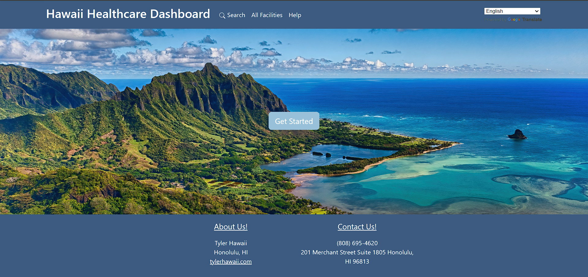
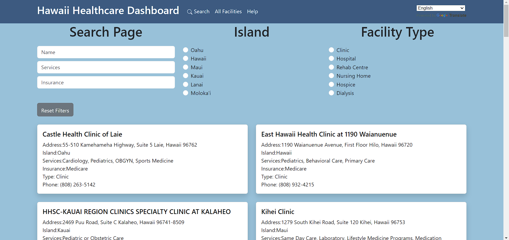

# Hawai'i Annual Code Challenge 2023
Every year, the state of Hawaii hosts a hackathon called the Hawai'i Annual Code Challenge (HACC). The goal of the hackathon is to create a project that will benefit the state of Hawaii. In 2023, I participated in the hackathon with a team of 4 other people.

## The Challenge
Before the Hackathon, the state gathers challenges and problems that they want to be solved. The challenges are then posted on the HACC website for people to look at and decide which challenge they want to work on. My team decided to work on the challenge called "Tyler Hawaii Healthcare Dashboard". The challenge was to create a dashboard that would allow users to filter and find Healthcare facilities.

## Our Solution

Our solution was to create a dashboard that would allow users to search for healthcare facilities and filter them by name, services, insurance, island, and facility type. We also implemented a translate feature for the website because of how diverse Hawaii is.

## My Impact

My main role in this project was to organize our group and implement the search functionality. I used the MongoDB database to store the data and used the React framework to create the front end.

### Links
Current Deployment: <a href="http://tyler-healthcare-dashboard.care/"><i>http://tyler-healthcare-dashboard.care/</i></a>

Github Repo: <a href="https://github.com/bencatcraw/HACC2023"><i>https://github.com/bencatcraw/HACC2023</i></a>

HACC Website: <a href="https://hacc.hawaii.gov/"><i>https://hacc.hawaii.gov/</i></a>
