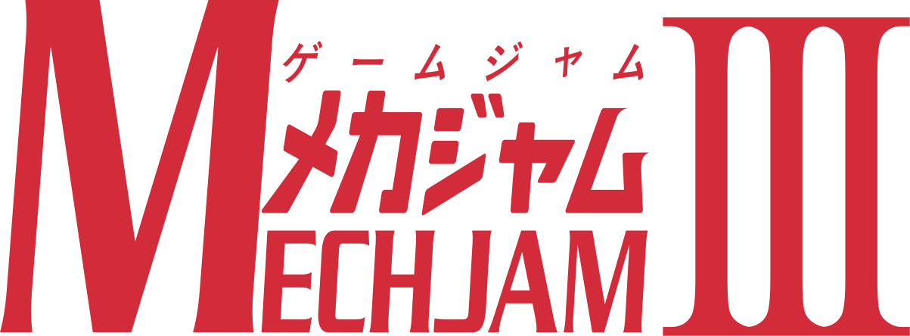

## The Game
This game was created for the MechJam III game jam by the UH Manoa Game Dev Club. It was a two week jam and the theme was anything related to mechs. One fun thing about these jams is they often have secondary themes so we decided to also choose the shapeshifting theme. The game is about a mech that can switch between earth, water, and fire abilities that let it solve puzzles to progress through the levels.

## My Impact
I was one of the more experienced members going into this jam so I spent most of my time doing all the game mechanic programming. I worked on everything from the movement to the puzzle interactions and I am really happy with the turnout of the game.

### Links
Play Here: <a href="https://bencatcraw.itch.io/untitled-mech-game"><i class="large github icon "></i>bencatcraw.itch.io/untitled-mech-game/</a>

MechJam3: <a href="https://itch.io/jam/mechjam3"><i class="large github icon "></i>itch.io/jam/mechjam3/</a>
